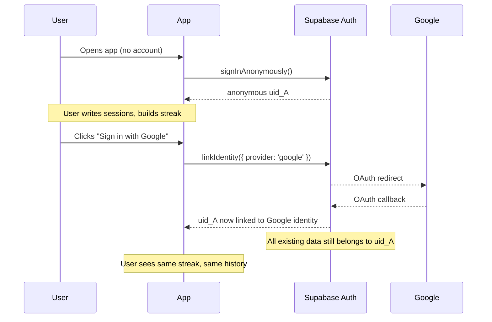

# Auth Migration — Anonymous to Permanent OAuth

**Classification:** Data Integrity  
**Scope:** Linking existing Anonymous Supabase `auth.uid()` records to new permanent OAuth (Google/Apple) identities without data loss.

---

## 1. Problem Statement

DeepFlow currently uses Supabase Anonymous Auth — each device gets a unique `auth.uid()`. When a user upgrades to OAuth (Google Sign-In, Apple ID), a **new** `auth.uid()` is created. Without a migration, the user loses access to:

- Previous writing sessions (`writing_sessions` table)
- Previous draft content (`drafts` table)
- Graveyard backups (`graveyard` table)
- Streak count and Grace Tokens (`profiles` table)

---

## 2. Migration Strategy: Identity Linking

Supabase supports **linking anonymous identities to OAuth identities** via `auth.linkIdentity()`. This is the recommended path because it keeps the same `auth.uid()` — no data reassignment needed.

### 2.1 Flow



### 2.2 Implementation

```js
// 1. User is already signed in anonymously (uid_A)
// 2. User clicks "Sign in with Google"
const { data, error } = await supabase.auth.linkIdentity({ provider: 'google' });

if (error) {
  // Handle: e.g., "This Google account is already linked to another user"
  // Fallback: data merge via admin API (see §3)
}
```

No database migration is needed — the `auth.uid()` never changes.

---

## 3. Fallback: Admin Data Reassignment

If `linkIdentity()` fails (e.g., the Google account already exists as a separate identity), the data must be reassigned server-side:

### 3.1 Requirements

- Supabase `service_role` key (must be kept server-side, never in client)
- Access to the Supabase SQL Editor

### 3.2 SQL Migration Script

```sql
-- Step 1: Find the anonymous user's profile
select id from auth.users where email is null and raw_user_meta_data->>'provider' is null;

-- Step 2: Reassign all data to the new OAuth user
update public.writing_sessions
set user_id = '<new-oauth-uid>'
where user_id = '<old-anonymous-uid>';

update public.drafts
set user_id = '<new-oauth-uid>'
where user_id = '<old-anonymous-uid>';

update public.graveyard
set user_id = '<new-oauth-uid>'
where user_id = '<old-anonymous-uid>';

-- Step 3: Delete the old anonymous profile
delete from public.profiles where id = '<old-anonymous-uid>';

-- Step 4: Update the OAuth user's profile with old streak/tokens
update public.profiles
set
  streak_count = (select streak_count from public.profiles where id = '<old-anonymous-uid>'),
  grace_tokens = (select grace_tokens from public.profiles where id = '<old-anonymous-uid>')
where id = '<new-oauth-uid>';
```

### 3.3 Safety Checks

- Run in a transaction (`BEGIN ... COMMIT`)
- Dry-run with `SELECT COUNT(*)` before each `UPDATE`
- Back up both `profiles` rows before deletion

---

## 4. UX Considerations

- **Prompt timing**: Show "Sign in to save your data across devices" after the user's 3rd session (not on first launch).
- **Grace period**: Keep anonymous data for 30 days after OAuth link. If the user unlinks, they regain access.
- **Data merge conflicts**: If both anonymous and OAuth users have data, give priority to the OAuth user's data (most recent activity wins).

---

## 5. Recovery UI

The Recovery Vault (see `src/components/VaultModal.jsx`) already queries `graveyard` via RLS. After migration, the same `auth.uid()` is in use, so no changes to the vault component are needed.

---

---

## 6. Secret Management Policy

### 6.1 Prohibition on Hardcoded Keys

**All API keys, tokens, and secrets MUST be loaded from environment variables.** No raw key strings may appear in source code files (`.js`, `.jsx`, `.ts`, `.tsx`, etc.). This includes Superwall, RevenueCat, Supabase, Stripe, and Mixpanel credentials.

### 6.2 Approved Access Patterns

| Platform | Mechanism | Config File |
|----------|-----------|-------------|
| **React Native** | `react-native-config` (via `Config.X`) | `DeepFlowMobile/.env` (gitignored) |
| **Web (Vite)** | `import.meta.env.VITE_X` | root `.env` (gitignored) |
| **Python scripts** | `os.getenv("X")` with `python-dotenv` | root `.env` (gitignored) |
| **CI/CD** | Repository secrets / environment variables | GitHub Actions / Netlify env vars |

### 6.3 `.env` File Rules

- Each platform that needs env vars gets its own `.env` file at the module root.
- `.env` files are listed in `.gitignore` and **never committed**.
- `.env.example` files contain placeholder values (`pk_xxx`, `sk_xxx`) and **are committed**.
- All `.env` files must use `KEY=VALUE` format (one per line, no quotes).
- Values must not contain trailing whitespace or inline comments.

### 6.4 Audit Procedure

Before every signed release:
1. Run `grep -r 'sk_live\|pk_live\|sk_test\|pk_test' src/ DeepFlowMobile/src/` — **zero matches required in source code**.
2. Verify `.env.example` is present and contains no real keys.
3. Verify `.gitignore` lists `.env` and `.env.*` except `.env.example`.

---

## 7. Native Deep Link Configuration

The OAuth flow uses the custom URI scheme `deepflow://auth/callback` to return the user to the app after browser-based sign-in. Each platform requires native configuration.

### 7.1 Android (Capacitor)

**File:** `android/app/src/main/AndroidManifest.xml`

The main activity already includes the intent-filter to handle the `deepflow` scheme. Verify the `<activity>` block contains:

```xml
<intent-filter>
    <action android:name="android.intent.action.VIEW" />
    <category android:name="android.intent.category.DEFAULT" />
    <category android:name="android.intent.category.BROWSABLE" />
    <data android:scheme="deepflow" android:host="auth" android:pathPrefix="/callback" />
</intent-filter>
```

**Notes:**
- `android:launchMode="singleTask"` is already set on the activity (required for deep links to re-route to the existing activity instead of creating a new one).
- Capacitor's `BridgeActivity` automatically handles incoming intents and forwards them to the web layer via `onNewIntent`.

**Test from terminal (device/emulator must be running):**
```bash
adb shell am start -W -a android.intent.action.VIEW -d "deepflow://auth/callback?code=test" com.deepflow.app
```

After running the command, the app should be brought to the foreground and the auth callback handled.

### 7.2 iOS (Capacitor)

**Prerequisite:** Run `npx cap add ios` to create the iOS native project.

**File:** `ios/App/App/Info.plist`

Add the following entry inside the `<dict>` block:

```xml
<key>CFBundleURLTypes</key>
<array>
    <dict>
        <key>CFBundleURLSchemes</key>
        <array>
            <string>deepflow</string>
        </array>
        <key>CFBundleURLName</key>
        <string>com.deepflow.app</string>
    </dict>
</array>
```

**File:** `ios/App/App/AppDelegate.swift` (Capacitor template)

Capacitor's `AppDelegate` already handles `application(_:open:options:)` via the `CAPBridgeViewController`. No additional code is needed — the bridge automatically routes custom URL schemes to the web layer.

**Verify:**
1. Open `ios/App/App/AppDelegate.swift` and confirm the `application(_:open:options:)` method exists (it is part of the Capacitor template). It should call `applicationDelegate.application(self, open: url, options: options)`.
2. After building, use Safari to navigate to `deepflow://auth/callback?code=test` on the iOS simulator — it should open the app.

### 7.3 Supabase Redirect Configuration

In the Supabase dashboard, add the following redirect URL to **Authentication > URL Configuration > Redirect URLs**:

```
deepflow://auth/callback
```

This must be set for the OAuth provider (Google, Apple) to redirect back to the app after authentication.

---

*Document version: 1.2 — Phase 5.2 Security Hardening (added §7 Native Deep Link Configuration)*
