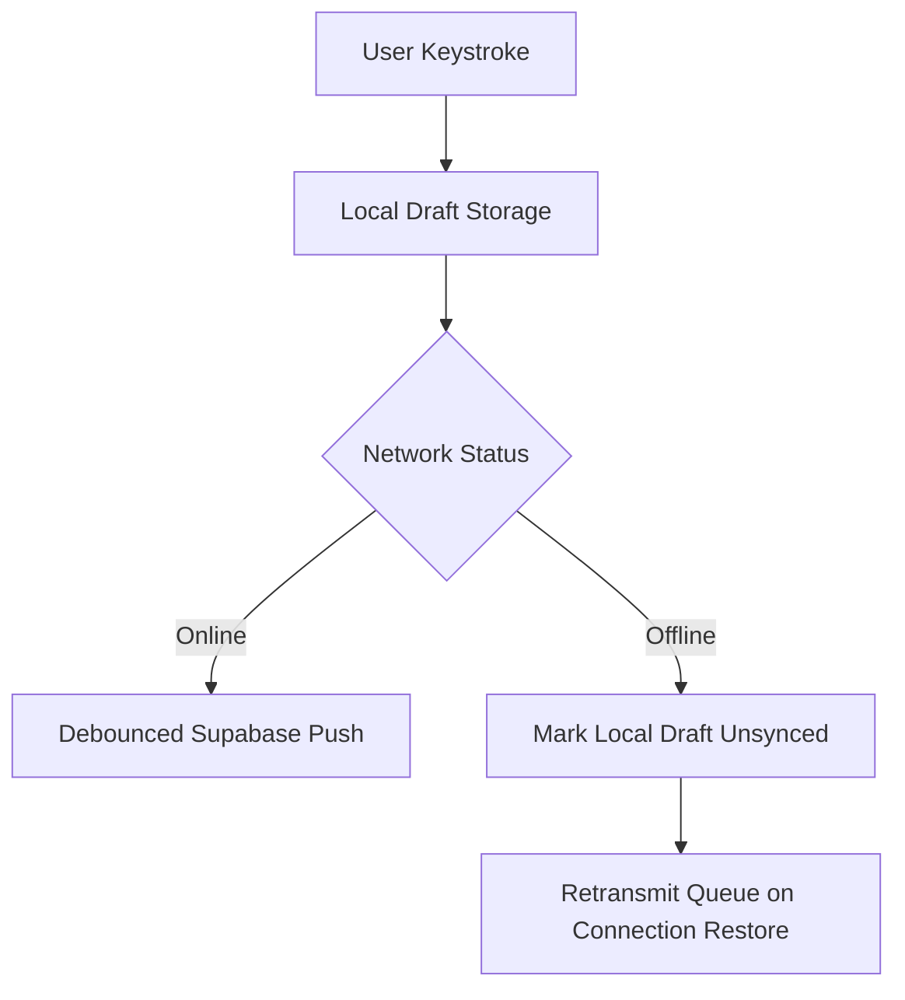

# Cloud-Sync Guardrails & Graveyard Protocol

This document outlines the synchronization rules, offline resilience protocols, and vault backup routines for the DeepFlow local-first architecture.

---

## 1. Local-First Write Path

To ensure zero writing data is ever lost due to network latency, connection drops, or database errors:



1. **Keystroke Capture**: When the user types, the draft content is immediately persisted to `localStorage` (via `SyncService.saveDraftLocally`) under the key `draft:<session_id>`.
2. **Debounce Queue**: The remote synchronization to the Supabase `drafts` table is debounced by `5000ms`.
3. **Synchronous Flush**: During critical transitions (e.g. Session Completed, Guillotined, Give Up), the debounce timer is bypassed, and the sync service executes a blocking flush of the draft to ensure the cloud record is up-to-date.

---

## 2. The Graveyard Protocol (Tiered Vault Backup)

When a session enters the `GUILLOTINED` state (idle warning expires), the app must execute a backup of the text to a secure, isolated schema. This isolates abandoned draft data from the active writing environment but preserves it for potential recovery.

1. **Trigger**: Transition to `STATES.GUILLOTINED`.
2. **Action**:
   - The sync service executes `flush()` to write the latest draft content to the database.
   - A copy is inserted into the `graveyard` table:
     ```sql
     insert into public.graveyard (session_id, user_id, content, word_count, deleted_at)
     values (session_id, user_id, content, word_count, now());
     ```
   - Once successfully written to the graveyard, the active draft record in `drafts` can be pruned to keep the active database light.
3. **Recovery Window**:
   - Graveyard backups are held for `30 days`. After 30 days, a cron job or database trigger deletes expired graveyard items.
   - Recovery is restricted: users cannot query the `graveyard` table directly from the app interface unless they trigger the recovery protocol (requiring a token or premium status).

---

## 3. Row Level Security (RLS) Guardrails

All synchronization tables must enforce strict RLS to isolate user data.
- **Profiles Table**: Users can view and update only their own profile row.
- **Writing Sessions Table**: Users can view, insert, and update only sessions where `auth.uid() = user_id`.
- **Drafts Table**: Users can view, insert, update, and delete only drafts where `auth.uid() = user_id`.
- **Graveyard Table**: Users can insert only their own records, and query them only during an active authorized recovery phase.
